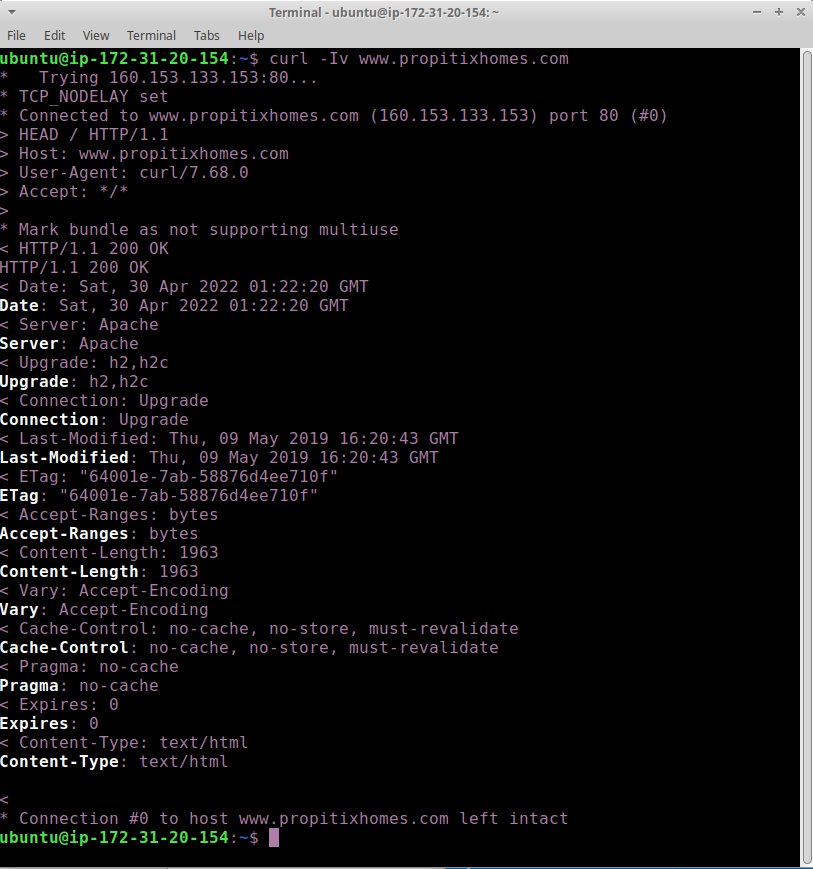

# CLIENT-SERVER ARCHITECTURE WITH MYSQL

In Project 1 you implemented a LAMP STACK website, let us take an example of commercially deployed LAMP website – www.propitixhomes.com.

This LAMP website server(s) can be located anywhere in the world and you can reach it also from any part of the globe over global network – Internet.

Assuming that you go on your browser, and typed in there www.propitixhomes.com. It means that your browser is considered the "Client". Essentially, it is sending request to the remote server, and in turn, would be expecting some kind of response from the remote server.

Lets take a very quick example and see Client-Server communicatation in action.

1. Open up your Ubuntu or Windows terminal and run curl command: ` curl -Iv www.propitixhomes.com`

2. 