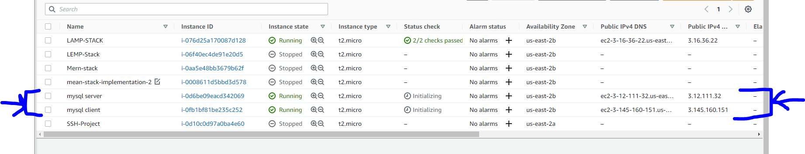
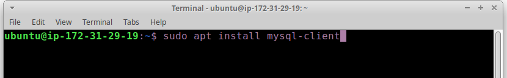
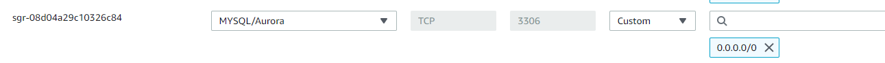
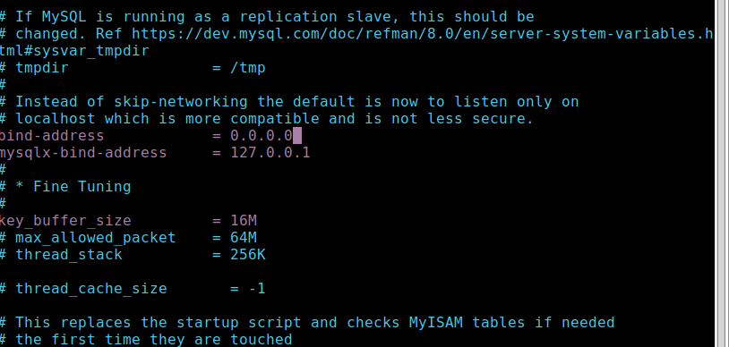
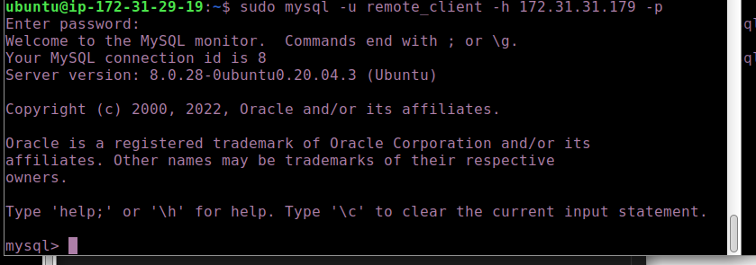
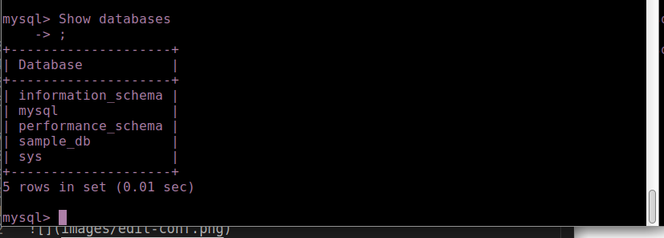

# IMPLEMENT A CLIENT SERVER ARCHITECTURE USING MYSQL DATABASE MANAGEMENT SYSTEM (DBMS)

### TASK – Implement a Client Server Architecture using MySQL Database Management System (DBMS)

<p>To demonstrate a basic client-server using MySQL Relational Database Management System (RDBMS), follow the below instructions</p>

1. Create and configure two-Linux based virtual servers (EC2 instances in AWS)

- Server A name - `mysql server`
- Server B name - `mysql client`



2. On mysql server Linux Server install MySQL Server software.

run the following to update and upgrade your packages before installing mysql-client

`sudo apt update`
`sudo apt upgrade`

run `sudo apt mysql-server`


3. On mysql client Linux Server install MySQL Client software.

`sudo apt update`
`sudo apt upgrade`

run `sudo apt mysql-client`


4. By default, both of your EC2 virtual servers are located in the same local virtual network, so they can communicate to each other using local IP addresses. Use mysql server's local IP address to connect from mysql client. MySQL server uses TCP port 3306 by default, so you will have to open it by creating a new entry in ‘Inbound rules’ in ‘mysql server’ Security Groups. For extra security, do not allow all IP addresses to reach your ‘mysql server’ – allow access only to the specific local IP address of your ‘mysql client’.



5. You might need to configure MySQL server to allow connections from remote hosts.

`sudo vi /etc/mysql/mysql.conf.d/mysqld.cnf`

Replace ‘127.0.0.1’ to ‘0.0.0.0’ like this:



6. From mysql client Linux Server connect remotely to mysql server Database Engine without using SSH. You must use the mysql utility to perform this action.

To do this create a user with privileges to enable remote login to the mysql server

sample:
```sql
CREATE USER 'remote_user'@'%' IDENTIFIED WITH mysql_native_password BY 'password';
CREATE DATABASE test_db;
GRANT ALL ON test_db.* TO 'remote_user'@'%' WITH GRANT OPTION;
FLUSH PRIVILEGES;
```

use the command `mysql -u <username> -p <password>-h HOSTNAME_OR_IP`



7. Check that you have successfully connected to a remote MySQL server and can perform SQL queries:



